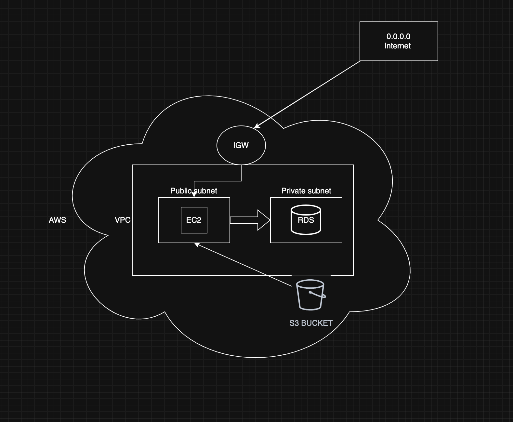

# GroceryMate

## 🏆 GroceryMate E-Commerce Platform

[](https://www.python.org/)
[](https://www.kernel.org/)
[](https://www.postgresql.org/)
[](https://github.com/AlejandroRomanIbanez/AWS_grocery/releases/tag/v2.0.0)
[](#-license)

⭐ **Star us on GitHub** — it motivates us a lot!

---

## Overview
GroceryMate is a full stack application deployed
on Amazon Web Services.

### Frontend

Frontend is the part of an application that users interact with directly.
Our project is using React library for smooth user interaction.

### Backend

The backend handles the application logic, data processing, 
and communication with the database, 
We are using Flask framework

### Database

Our database is responsible for storing and
managing application data, and 
we are using PostgreSQL as our relational database system.


## Architecture Diagram


## Infrastructure Components
These are the AWS resources that we are using for our architecture


| Services       | Description                                                                                                                                                 |
|----------------|-------------------------------------------------------------------------------------------------------------------------------------------------------------|
| EC2            | Virtual servers that gives full control to host backend apps,websites,or software just like a real server.                                                  |
| VPC            | Lets you create a private, isolated network within AWS where you can launch and control resources with your own IP ranges, subnets, and security settings.  |
| RDS            |Is a managed cloud database service that makes it easier to set up, operate, and scale relational databases without handling server maintenance yourself. 
| S3             |Its a cloud storage service used to store files like images, videos, backups, and static websites. It is highly scalable, secure and cost-effective.                                   
| Security Group | Security Groups as a firewall to control traffic to and from resources (like EC2). It allows only specific parts, IPs, or services for security.              
| Route Tables   | Let you control how network traffic flows inside a VPC.                        
| IAM            | It securely grant permissions to AWS services. Instead of using passwords, services like EC2 can access S3 or RDS safely using roles.                        
| IGW            | Internet gateway is a networking component that allows communication between VPC and the public internet.


## Terraform
Terraform is used to automate and manage your infrastructure (like AWS resources) using code instead of manual setup.

Key reasons to use Terraform:

Automation & Speed, with terraform you can create or update your entire infrastructure in minutes with one command.

Consistency
Same configuration = same infrastructure every time (no human errors).

Version Control
    
It can store your infrastructure code in Git and track changes.
Multi-cloud support
Works with AWS, Azure, Google Cloud, etc.


Common Terraform Commands

Here are the main commands i use:

1. Initialize Terraform

```console
 terraform init 
```

Downloads required plugins (like AWS provider)

2. Format Code

```console
 terraform fmt
```

Cleans and formats your code properly

3. Validate Configuration

```console
 terraform validate
```

Checks if your code is correct (no syntax errors)

4. Plan Changes

```console
 terraform plan
```

Shows what Terraform will create, update, or delete before applying

5. Apply Configuration

```console
 terraform apply
```

Actually creates or updates your infrastructure

6. Destroy Infrastructure

```console
 terraform destroy
```

Deletes all resources created by Terraform


7. Show Current State

```console
 terraform show
```

Displays current infrastructure


## Docker

Docker is a platform that lets you package an application and all its dependencies into a container, so it can run the same way on any computer or server.


Simple Explanation
Docker solves the problem of:
"It works on my machine, but not on another one."

With Docker, your app runs exactly the same everywhere on your laptop, a server, or in the cloud.


What is a Container?

A container is a lightweight package that includes:
Your application code
Required libraries
System tools
Runtime environment
Everything needed to run the app is inside the container.

Why Use Docker?

Consistency
Same environment everywhere (no errors due to differences)
Portability
Run your app on any system that has Docker
Fast Deployment
Start containers in seconds
Isolation
Each app runs separately without conflicts
Scalability
Easily run multiple containers for large

Run the following command inside the project folder (where the Dockerfile is located):

```console
 docker build -t grocerymate-app .
```

Once the image is built, start a container using:

```console
 docker run -it -p 5000:5000 grocerymate-app
```


## Environmental variable 

A .env file (environmental variables file) is used to store configuration settings and sensitive data outside your main code.

Instead of hardcoding things like passwords or API keys inside your application, you put them in a .env file and load them when the app runs.

A .env file is a safe place to keep important settings your application needs to run.

The environmental variables that we are using for this project are:

| Services          | Description                                                                                           |
|-------------------|-------------------------------------------------------------------------------------------------------|
| JWT_SECRET_KEY    | Your generated key                                                                                    |
| POSTGRES_USER     | grocery_user |
| POSTGRES_PASSWORD | A secure password                                                                                             
| POSTGRES_DB       | grocerymate_db                                                                                              
| POSTGRES_HOST     | host.docker.internal                                                                                              
| POSTGRES_URI      | postgresql://${POSTGRES_USER}:${POSTGRES_PASSWORD}@${POSTGRES_HOST}:5432/${POSTGRES_DB}                                                                                             
| AWS_REGION        | Your prefered AWS region                                                                                              
| S3_BUCKET_NAME    | Your Bucket Name                                                                                              


